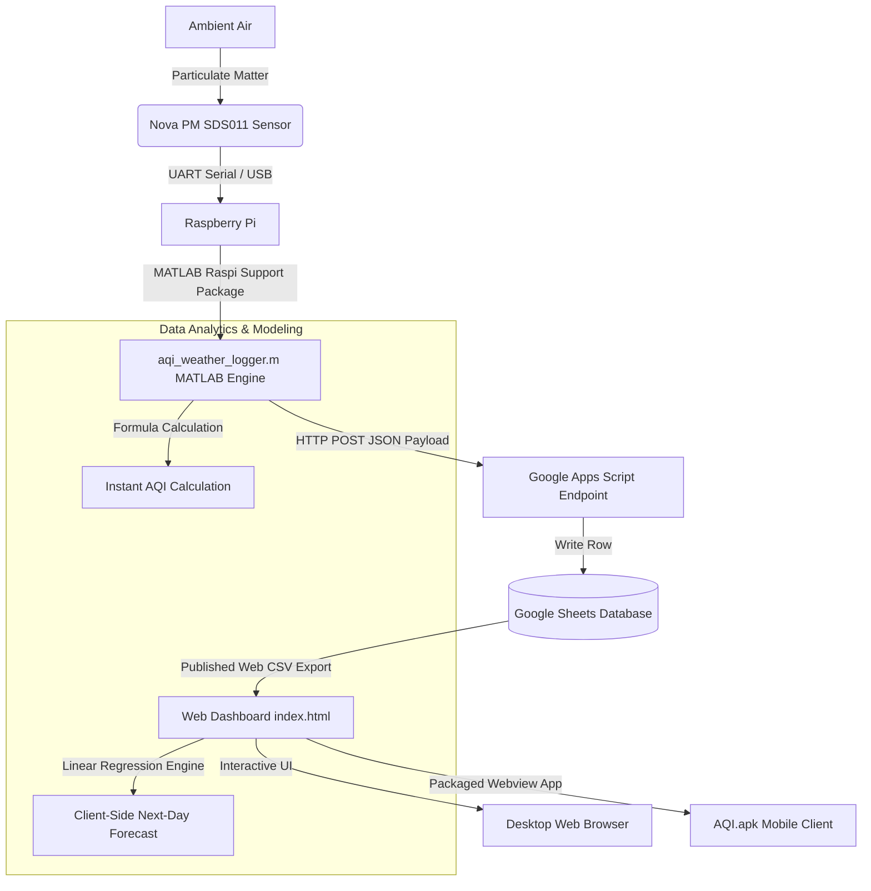

# Real-Time Air Quality Index (AQI) & Weather Logger

[](https://www.mathworks.com/products/matlab.html)
[](https://www.raspberrypi.com/)
[](https://www.google.com/sheets/about/)
[](https://tailwindcss.com/)
[](https://www.android.com/)

An end-to-end, ultra-responsive IoT system for monitoring, logging, and forecasting real-time Air Quality Index (AQI). The system utilizes a Raspberry Pi connected to a Nova PM SDS011 Particulate Matter Sensor to continuously log ambient air quality data. The logged values are processed in MATLAB, transmitted to a central Google Sheets database using Google Apps Script, and displayed on a web-based dashboard and a dedicated Android application.

---

## System Architecture

The following diagram illustrates the real-time data flow from the physical environment to the digital user interfaces:



---

## Features

- **Real-Time Data Collection**: Captures high-frequency PM2.5 and PM10 particulate levels using physical laser scattering sensors.
- **Animated Live Plotting**: Interactive, real-time MATLAB graphics engine visualizing immediate AQI trends with a continuous animated line.
- **Cloud Database Integration**: Seamless transmission of structured data directly into a public Google Sheets repository, acting as a serverless database.
- **Sleek Web Dashboard**: A premium, high-aesthetic glassmorphic UI built with Tailwind CSS and the Outfit typography system.
- **Floating Micro-Animations**: Interactive, background particle effects that simulate atmospheric concentration levels.
- **Smart Trend Forecasting**: Built-in client-side Linear Regression algorithm modeling previous intervals to forecast next-day AQI ranges and confidence scores.
- **Reverse Geolocation**: Auto-locates the user's coordinate system using browser APIs to display local city air quality dynamically.
- **Mobile Portability**: Packaged native Android App (AQI.apk) for immediate on-the-go monitoring.

---

## Hardware Requirements

1. **Raspberry Pi** (Model 3B, 3B+, 4, or 5) running Raspberry Pi OS.
2. **Nova PM SDS011 Sensor** (High-precision laser PM2.5 / PM10 sensor) with USB-UART Bridge Controller.
3. Stable Network Connection (Local Area Network or Wi-Fi).

### Sensor Connection

Connect the Nova PM SDS011 sensor to one of the USB ports of your Raspberry Pi using the included USB-to-serial adapter. The system expects the device to register under:
`'/dev/ttyUSB0'` (UART Serial Port, configured at `9600` baud, `8` data bits, `no` parity).

---

## Software Stack

- **MATLAB**: Used as the remote command-and-control daemon. Requires the *MATLAB Support Package for Raspberry Pi Hardware*.
- **Google Apps Script**: Serves as the webhook receiver, accepting secure HTTP POST requests and binding data to Google Sheets.
- **Frontend Dashboard**: HTML5, Tailwind CSS, Lucide Icons, and Outfit Font. Implements local storage, smooth SVG transition arcs, reverse geocoding, and custom prediction logic.
- **Element SDK Integration**: Offers run-time customization support (`elementSdk`), allowing live changes to colors, font sizes, text styles, and geographic tags.

---

## Mathematical Formulations

### 1. Air Quality Index (AQI) Derivation
The script processes raw PM2.5 and PM10 values to calculate a unified AQI metric instantly. The scalar mathematical approximation utilized in the MATLAB algorithm is defined as:

$$\text{AQI} = \text{round}\left( \max\left(\text{PM}_{2.5} \times 2, \; \text{PM}_{10} \times 1.5\right) \right)$$

This provides an immediate, safety-first indication of quality based on the dominant particulate pollutant.

### 2. Next-Day Trend Forecasting
The Web Dashboard runs a client-side linear regression on the latest 6 historical records to extrapolate and project the subsequent 24-hour AQI range. 

Given a sequence of data points $(t_i, y_i)$ where $t_i$ represents the time in minutes and $y_i$ represents the calculated AQI, the dashboard calculates the slope ($m$) and intercept ($c$) using the least-squares method:

$$m = \frac{\sum_{i=1}^{n} (t_i - \bar{t})(y_i - \bar{y})}{\sum_{i=1}^{n} (t_i - \bar{t})^2}$$

$$c = \bar{y} - m\bar{t}$$

Extrapolating for the next 24-hour target $t_{\text{target}} = t_n + 1440$, the forecast is computed as:

$$\text{Forecast} = m \cdot t_{\text{target}} + c$$

The system rounds this prediction into a stable $\pm 5$ range (e.g., `35-45`) to provide a reliable forecast block alongside a dynamic confidence metric.

---

## Setup & Deployment

### Step 1: Google Sheets Setup & Apps Script Web App
To store your data in the cloud:
1. Create a new **Google Sheet**.
2. Set up the first row with headers:
   | Column A | Column B | Column C | Column D | Column E | Column F |
   | :--- | :--- | :--- | :--- | :--- | :--- |
   | **Date** | **Time** | **AQI** | **PM2.5** | **PM10** | **Type** |
3. Go to **Extensions** > **Apps Script**.
4. Clear any template code and paste the following Google Apps Script:

```javascript
function doPost(e) {
  try {
    var data = JSON.parse(e.postData.contents);
    var sheet = SpreadsheetApp.getActiveSpreadsheet().getActiveSheet();
    
    // Split incoming MATLAB timestamp: 'YYYY-MM-DD HH:MM:SS'
    var datePart = data.Time.split(' ')[0];
    var timePart = data.Time.split(' ')[1];
    
    // Append parsed sensor payload as a database row
    sheet.appendRow([
      datePart, 
      timePart, 
      data.AQI, 
      data.PM25, 
      data.PM10, 
      data.Type
    ]);
    
    return ContentService.createTextOutput(JSON.stringify({ "status": "success" }))
      .setMimeType(ContentService.MimeType.JSON);
  } catch (err) {
    return ContentService.createTextOutput(JSON.stringify({ "status": "error", "message": err.toString() }))
      .setMimeType(ContentService.MimeType.JSON);
  }
}
```

5. Click **Deploy** > **New deployment**.
6. Select **Web app** as the deployment type.
7. Configure:
   - *Execute as*: `Me`
   - *Who has access*: `Anyone`
8. Click **Deploy**, authorize permissions, and copy the provided **Web App URL**.
9. Publish the sheet to the web as a CSV:
   - Click **File** > **Share** > **Publish to web**.
   - Select **Entire Document** (or your active sheet name) and choose **Comma-separated values (.csv)**.
   - Click **Publish** and copy the resulting CSV link.

---

### Step 2: MATLAB Logger Configuration
Open [aqi_weather_logger.m](file:///d:/PROJECTS/001MATLAB/SENSOR/aqi_weather_logger.m) and configure your network credentials and Apps Script URL:

```matlab
%% ================= CONFIG =================
cfg.pi_ip   = '192.168.1.242';      % Replace with your Raspberry Pi's local IP address
cfg.username = 'admin';              % Raspberry Pi SSH username
cfg.password = 'thingspeak';         % Raspberry Pi SSH password

% Replace with your specific Google Sheets Apps Script Web App URL
GOOGLE_SCRIPT_URL = "https://script.google.com/macros/s/YOUR-APPS-SCRIPT-ID/exec";
```

Ensure your computer has the **MATLAB Support Package for Raspberry Pi Hardware** installed. Run `aqi_weather_logger.m` in MATLAB to start collecting, plotting, and uploading real-time PM/AQI values.

---

### Step 3: Web Dashboard Setup
Open [index.html](file:///d:/PROJECTS/001MATLAB/SENSOR/index.html) and locate the data fetch block around line 234. Replace the default placeholder URL with your published CSV link:

```javascript
// --- Fetch data ---
async function fetchData() {
  try {
    // Replace the URL below with your published Google Sheets CSV export URL
    const url = 'https://docs.google.com/spreadsheets/d/e/YOUR-PUBLISHED-SPREADSHEET-ID/pub?gid=0&single=true&output=csv';
    const response = await fetch(url);
    const csv = await response.text();
    ...
```

Open `index.html` in any modern web browser or host it on your favorite web server (e.g., GitHub Pages, Vercel, Netlify) to access the live monitoring suite.

---

## File Structure

```bash
d:/PROJECTS/001MATLAB/SENSOR/
├── aqi_weather_logger.m   # MATLAB script establishing SSH/Serial connection, calculating AQI & uploading to cloud
├── index.html             # Fully responsive, modern visual dashboard (Tailwind CSS + Regression Engine)
├── AQI.apk                # Standalone native Android App mirroring the web-based tracking dashboard
├── AQI-Real-Time-App.pptx # Project presentation slide deck outlining design parameters and system testing
├── LICENSE                # Open-source MIT License file
└── README.md              # Project documentation (this file)
```

---

## Dashboard Visual Experience

The frontend web console provides an outstanding, interactive dashboard:
* **Glassmorphic Panels**: High-contrast, semi-transparent components layered over a sleek space-themed background.
* **Animated AQI Radial Indicator**: Responsive color-shifting ring (Green -> Yellow -> Orange -> Red) based on environmental hazards.
* **Interactive Historical Charting**: Dynamic bars that slide and expand on hover, featuring automatic data parsing and tooltips.
* **Ambient Atmosphere Simulation**: Floating particle effects moving dynamically based on real-time climate conditions.

---

## Contributing

Contributions to improve calculations, support additional PM sensors, or extend the visualization interface are welcome. Feel free to open issues or submit pull requests.

---

## License

This project is licensed under the MIT License - see the [LICENSE](file:///d:/PROJECTS/001MATLAB/SENSOR/LICENSE) file for details.
